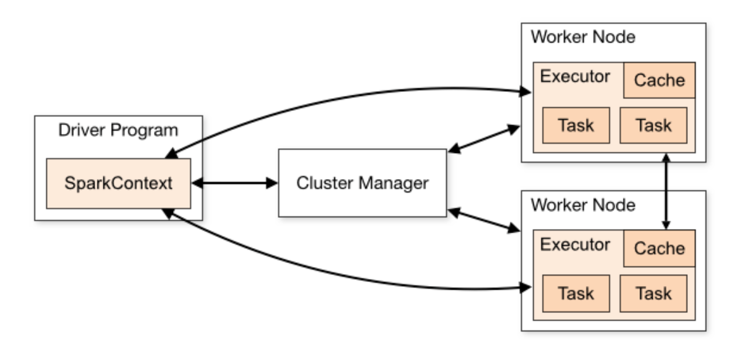

# Introduction To Spark Architecture View

## Spark Cluster Mode Overview

Spark applications run as independent sets of processes on a cluster, coordinated by the SparkContext object in your main program (called the driver program).

Specifically, to run on a cluster, the SparkContext can connect to several types of cluster managers (either Spark’s own standalone cluster manager, Mesos or YARN), which allocate resources across applications. Once connected, Spark acquires executors on nodes in the cluster, which are processes that run computations and store data for your application. Next, it sends your application code (defined by JAR or Python files passed to SparkContext) to the executors. Finally, SparkContext sends tasks to the executors to run.

There are several useful things to note about this architecture:

1. Each application gets its own executor processes, which stay up for the duration of the whole application and run tasks in multiple threads. This has the benefit of isolating applications from each other, on both the scheduling side (each driver schedules its own tasks) and executor side (tasks from different applications run in different JVMs). However, it also means that data cannot be shared across different Spark applications (instances of SparkContext) without writing it to an external storage system.
   
2. Spark is agnostic to the underlying cluster manager. As long as it can acquire executor processes, and these communicate with each other, it is relatively easy to run it even on a cluster manager that also supports other applications (e.g. Mesos/YARN).
    
3. The driver program must listen for and accept incoming connections from its executors throughout its lifetime (e.g., see spark.driver.port in the network config section). As such, the driver program must be network addressable from the worker nodes.

4. Because the driver schedules tasks on the cluster, it should be run close to the worker nodes, preferably on the same local area network. If you’d like to send requests to the cluster remotely, it’s better to open an RPC to the driver and have it submit operations from nearby than to run a driver far away from the worker nodes.

## Cluster Manager Types
The system currently supports several cluster managers:

[Standalone](https://spark.apache.org/docs/latest/spark-standalone.html) – a simple cluster manager included with Spark that makes it easy to set up a cluster.
Apache Mesos – a general cluster manager that can also run Hadoop MapReduce and service applications.
Hadoop YARN – the resource manager in Hadoop 2.
Kubernetes – an open-source system for automating deployment, scaling, and management of containerized applications.
A third-party project (not supported by the Spark project) exists to add support for Nomad as a cluster manager.

## Monitoring
Each driver program has a web UI, typically on port 4040, that displays information about running tasks, executors, and storage usage. Simply go to http://<driver-node>:4040 in a web browser to access this UI. The [monitoring guide](https://spark.apache.org/docs/latest/monitoring.html) also describes other monitoring options.

## Components

### Drivers

Driver is a program that runs on the master node of the machine which declares transformations and actions on knowledge RDDs. In easy terms, the driver in Spark creates SparkContext, connected to a given Spark Master. It conjointly delivers the RDD graphs to Master, wherever the standalone cluster manager runs.

### Executors

The driver program ask for resources to the cluster manager to launch executors. Its just the space where
we can execute the operations. In other words, a process launched for an application on a worker node, that runs tasks and keeps data in memory or disk storage across them. Each application has its own executors.

### Nodes

Collections of Executors in a spark cluster or Any node that can run application code in the cluster.

### Parallelization

Maximum of 12 tasks; 6 Executors with 2 cores.

### Task

A single unit of work against a single partition of data or A unit of work that will be sent to one executor.

### Job

A parallel computation consisting of multiple tasks that gets spawned in response to a Spark action (e.g. save, collect); you'll see this term used in the driver's logs.
Consist of one or more stages. 

### Application

User program built on Spark. Consists of a driver program and executors on the cluster.

### Stage

Each job gets divided into smaller sets of tasks called stages that depend on each other (similar to the map and reduce stages in MapReduce); you'll see this term used in the driver's logs.

### Application Jar

A jar containing the user's Spark application. In some cases users will want to create an "uber jar" containing their application along with its dependencies. The user's jar should never include Hadoop or Spark libraries, however, these will be added at runtime.

## Documentation
 [pyspark documentation](https://spark.apache.org/docs/latest/api/python/index.html)